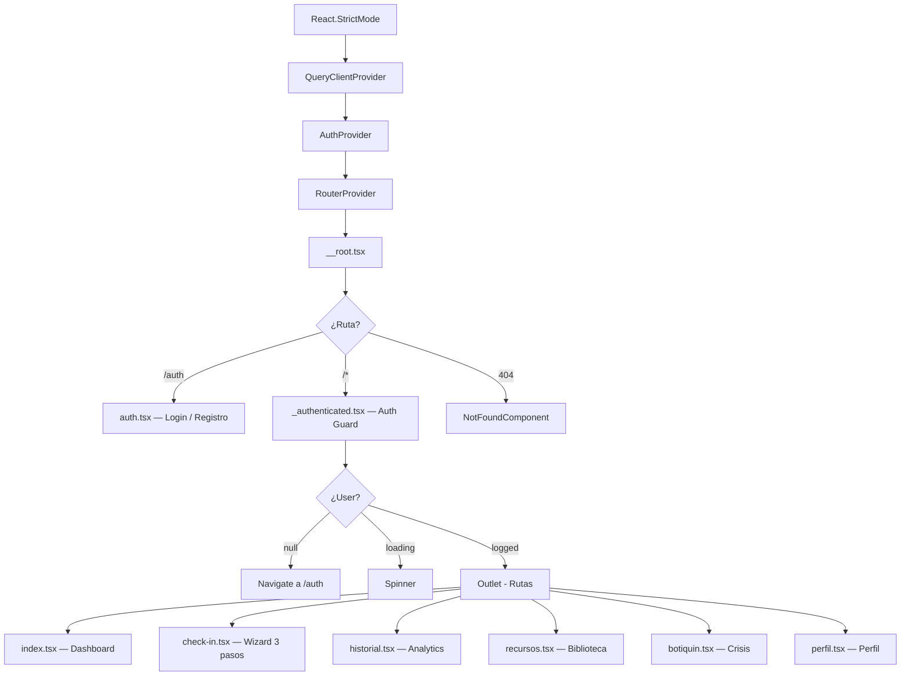
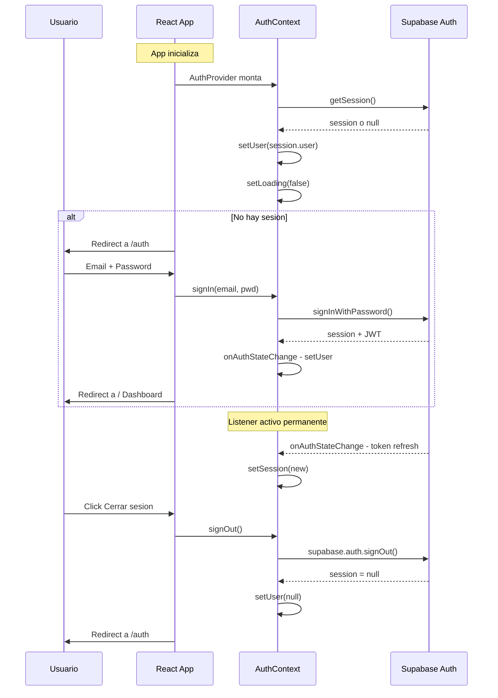
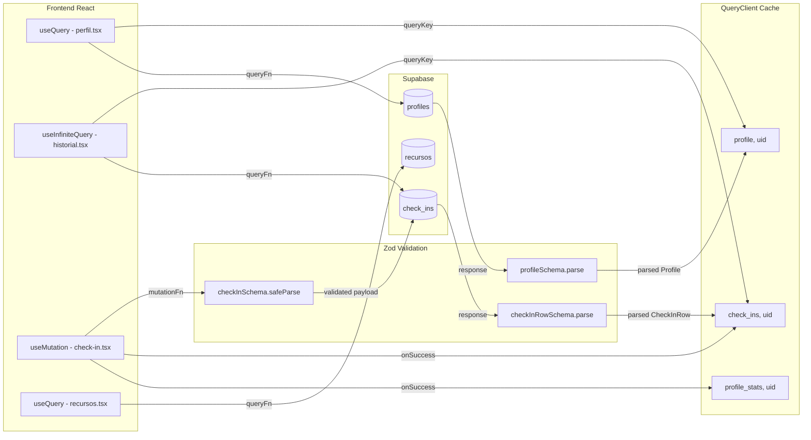
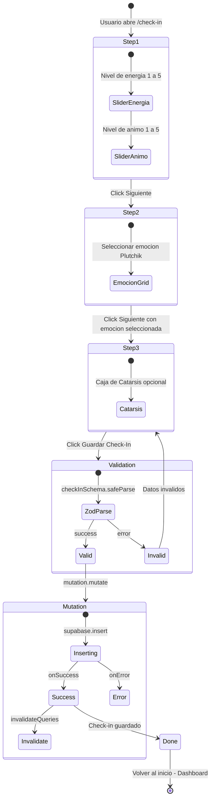
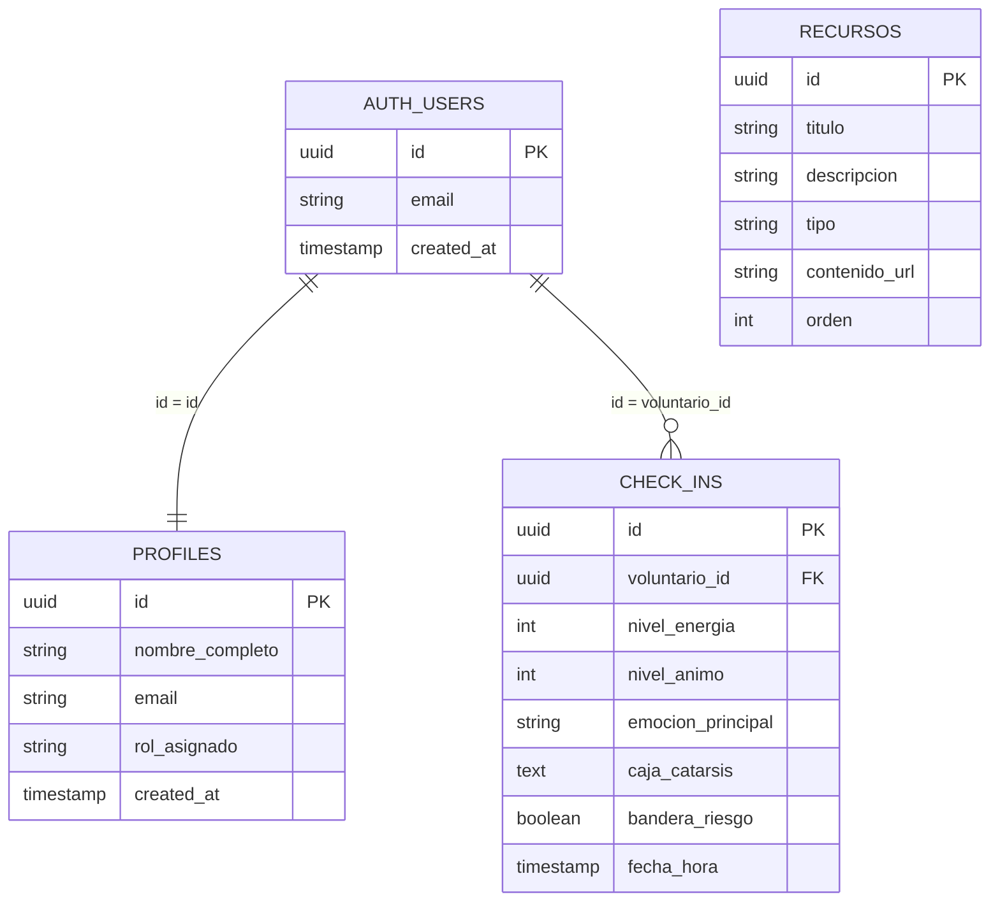
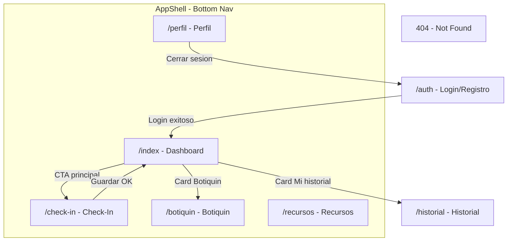

# 📊 VolunCare Pulse — Arquitectura Visual (Post-Hardening)

Generado bajo la regla **Visual Problem Solving** del Expert Functionality Framework.

---

## 1. Árbol de Componentes y Providers

---

## 2. Flujo de Autenticación

---

## 3. Flujo de Datos — React Query (Post-Hardening)

---

## 4. Flujo del Check-in — Wizard 3 Pasos

---

## 5. Schema de Base de Datos — Supabase

---

## 6. Mapa de Navegacion UX

